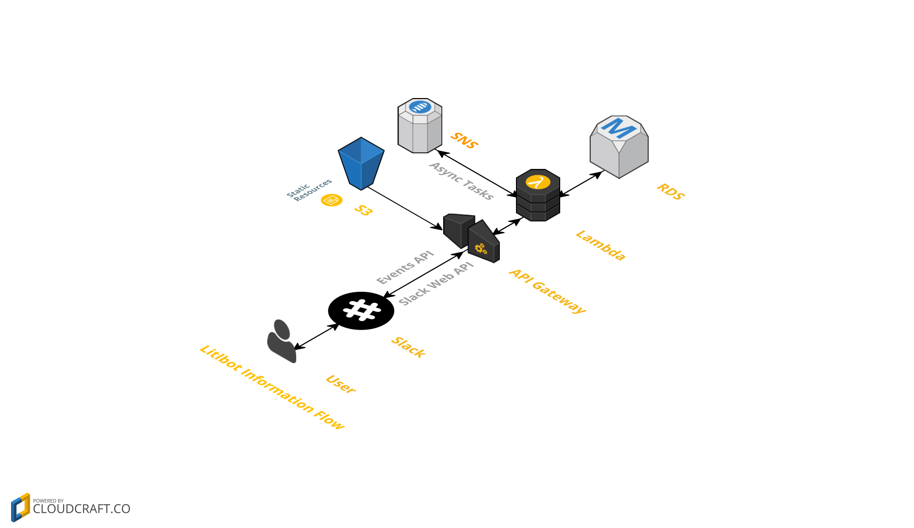

#Litlbot

**Update**: This bot won the AWS Serverless Chatbot Hackathon [http://devpost.com/software/litlbot-cqm54z](http://devpost.com/software/litlbot-cqm54z). :champagne: :raised_hands: :100:

Next generation ‘in classroom’ experience. Litlbot is a Slack bot that enables realtime interaction with students in class, for a more personalized learning.

##Digital Assistant for Professors
Litlbot allows professors to take a live 'in classroom' pop quiz or take a feedback survey from students. Questions could be based on course content, teaching speed, class notes, assignments, quizzes etc.

##Assess Feedback
Professors can view feedback results in a live classroom and adapt in real time.

##Students ask anonymous questions
Not every student is comfortable asking questions in a classroom. Litlbot allows students to anonymously ask questions.

## Deployment Instructions
[Click here](./Deployment.md)

##Live Demo
Head to[demo Link](https://jropljt2oa.execute-api.us-east-1.amazonaws.com/dev/) to see it in action.

## Testing instructions
1. Visit the [homepage](https://jropljt2oa.execute-api.us-east-1.amazonaws.com/dev/) to add the bot to your team.
2. Bot assumes that the user adding this bot is the professor and all other team members are students.
3. The best way to test the bot is have two windows side by side, where in one of the windows you are logged in as a professor and the other as a student.
3. Say `hi` to the bot and it will guide you about the functionality.

## Dev Stack
1. Python, Django
2. [Zappa](https://github.com/Miserlou/Zappa) - a serverless Python webservices framework
3. Slack [Events API](https://api.slack.com/events-api)

This is a Django web app. The project uses Zappa to deploy the app on AWS Lambda + API Gateway. The bot uses Slack Events API. The events are received on an API Gateway url and sent to Lambda for processing.
## AWS Services Used
1. API Gateway
2. Lambda
3. SNS
4. RDS
5. S3

##Architecture

